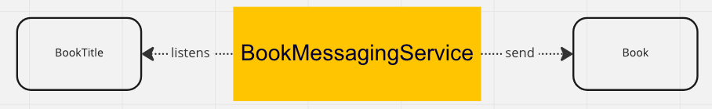

# Kafka example

## Specifications

MicroProfile Reactive Messaging makes use of and interoperates with two other specifications:

- *Reactive Streams* is a specification for doing asynchronous stream processing with back pressure. It defines a minimal set of interfaces to allow components which do this sort of stream processing to be connected together.
- *MicroProfile Reactive Streams* Operators is a MicroProfile specification which builds on Reactive Streams to provide a set of basic operators to link different reactive components together and to perform processing on the data which passes between them.

## Configuration

Dev Services for Kafka automatically starts a Kafka broker in dev mode for dev development and when running tests.
So, you do not have to start a broker manually.
The application is configured automatically.
Because starting a Kafka broker can be long, Dev Services for Kafka uses Redpanda, a Kafka compatible broker which starts in ~1 second.

## Architecture

